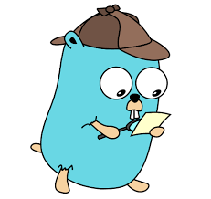

### Motivos que me fizeram aprender sobre Golang

Go é uma linguagem enxuta, moderna, compilada (muito rápida), e também é uma das poucas linguagens que surgiu depois dos processadores com múltiplos núcleos e isso fez com que a linguagem tenha mecanismo de concorrência, o que a torna ideal para aplicações na qual são exigidos um alto grau de desempenho.

