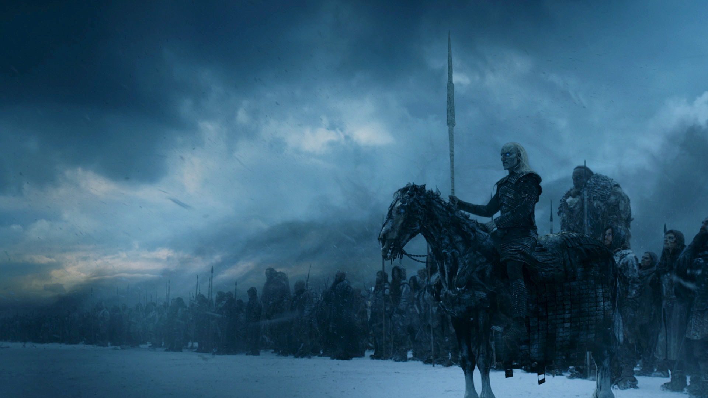
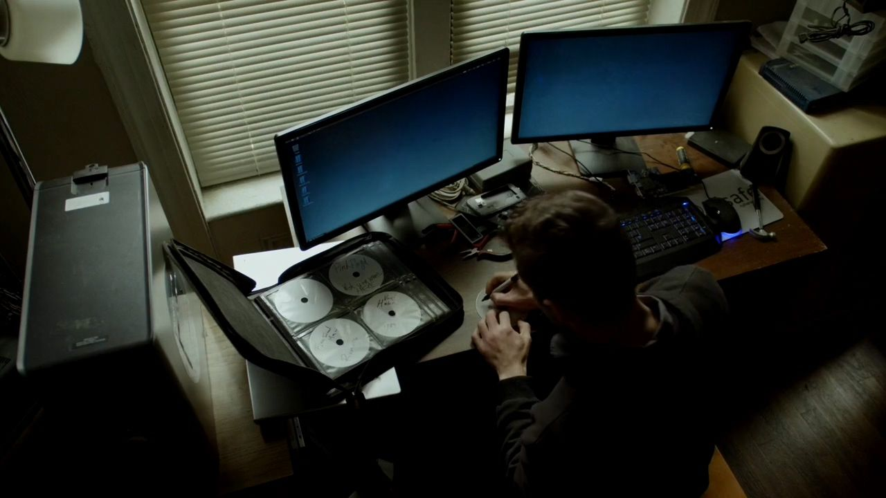

## Minhas séries favoritas.

### Got

A série é sobre a disputa entre famílias pelo controle dos Sete Reinos e o Trono de ferro.

É a melhor série que eu já vi na minha opinião, gosto das políticas e discussões que a série tem, e pelo mundo cheio de mistérios e criaturas.

### Rick and Morty

É um desenho animado sobre viagem no tempo-espaço e por universos paralelos, com o cientista louco e seu neto.

Acho essa série muito engraçada, o jeito que ela trata alguns problemas,
e o desenrolar das histórias.

### Mr. Robot

É sobre um hacker chamado Elliot que tem múltiplas personalidades, e tenta acabar com os problemas da sociedade.

O que eu achei legal nessa série foi o jeito que o conteúdo técnico foi tratado, muito parecido com a realidade, sem ter aquele hack viajado que não condiz nada com a realidade,  que na minha opinião é muito bom.

